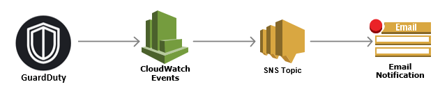

# enable-email-notification-for-guardduty
This script enable email notification for Amazon GuardDuty through CloudWatch Events and SNS Topics.

## Motivation
Amazon GuardDuty is a great threat detection service.  Like many other AWS service, GuardDuty is a modular design and it can be integrated with many other services such as Lambda, SNS, SQS, third-party SIEM or ticketing systems.  Because GuardDuty doesn't come with an email notification capability out of the box, I decided to write an example script and share with a community.

## Diagram

## Prerequisites
* Enable Amazon GuardDuty in all supported regions.  If you have multiple accounts, we recommend to enable and link them with ["amazon-guardduty-multiaccount-scripts" from aws-samples in GitHub](https://github.com/aws-samples/amazon-guardduty-multiaccount-scripts).
* AWS CLI is installed and configured with a profile name.

## Installation
* Download the script `enable-email-notification-for-guardduty.bash`
* Modify `VARIABLES` (`prof_name`, `acct_id`, `def_region` and `email_addr`)
* Make the script executable: `chmod +x enable-email-notification-for-guardduty.bash`
* Run it: `./enable-email-notification-for-guardduty.bash`
* Click to confirm "AWS Notification - Subscription Confirmation" emails for all regions

## Author
* Koji Kuramatsu - [LinkedIn](https://www.linkedin.com/in/kuramatsu)
